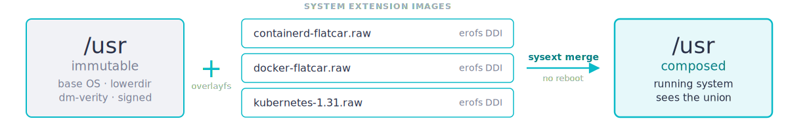
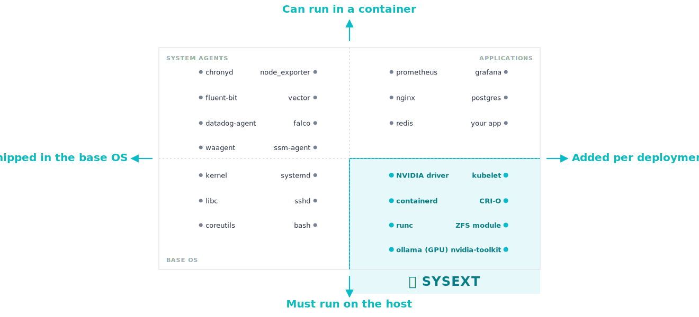

<!-- _class: cover -->
<!-- _paginate: false -->

# systemd-sysext in Production

## What We Learned Extending `/usr` Without a Package Manager

**Brian "bex" Exelbierd** &nbsp;·&nbsp; bex@bexelbie.com
**Daniel Zaťovič** &nbsp;·&nbsp; daniel.zatovic@gmail.com

DevConf.CZ &nbsp;·&nbsp; June 18, 2026 &nbsp;·&nbsp; Brno


<!--
-  intro
-->

---

<!-- _class: lead -->
<!-- _paginate: false -->

# TODO: 99 problems and they're all packaging

<!--
- I want to start with a frustration.
- Every distro, every immutable OS, every cloud-native platform — they all eventually trip over the same problem: "how do I get this binary onto that host in a way I can update and roll back without breaking everything else."
- This is the oldest problem in our industry and we keep inventing new answers to it.
- That's not a complaint. It's a setup.
-->

---

<!-- _class: lead -->
<!-- _paginate: false -->

# TODO: ...and now there are 15 standards


<!--
- (XKCD 927, "Standards" — Randall Munroe. If you've been around this industry you've seen this comic deployed in anger.)
- sysext is one of those standards. We are not going to pretend it makes the problem go away.
- What we ARE going to tell you is when it's the right one — and what we've learned shipping it in production for two and a half years.
-->

---

<!-- _class: agenda -->

# Agenda

- Why we needed sysext — immutable OS, then Torcx
- What sysext actually is
- How Flatcar ships it in production
- What broke, what we fixed
- When to reach for sysext
- Live demo
- Try it today

<!--
- Five sections, a demo, and a call to action.
- We open with the origin story: an immutable OS, the container-runtime tension, our home-grown Torcx, and why we traded it for a standard. That sets up everything else.
- The technical core is the middle three sections — what it is, how we ship it, what broke.
- Demo is real — boots a Flatcar VM, merges a Kubernetes sysext, then does the same thing on FCOS to show cross-distro portability.
-->

---

# We built an immutable OS — on purpose

Flatcar (and CoreOS before it) made a bet: **the OS is a signed, read-only image.**

- `/usr` is immutable and dm-verity protected — no package manager on the host
- Updates are **atomic A/B** — whole-image, auto-rollback, no half-patched states
- Every node in the fleet is **bit-identical** and reproducible

The entire value proposition is that you **can't** tweak the OS in place.

<!--
- Start with the design bet, because the rest of the talk is about a tension inside it.
- Flatcar's heritage is CoreOS Container Linux. The premise: treat the OS like firmware. Read-only /usr, verity, atomic updates, no rpm/dpkg on the host.
- This is great for security and for running a fleet — every machine is the same machine.
- But it sets up a problem: the thing people most want to change is sitting inside the part we froze hardest.
-->

---

# …but the container runtime won't sit still

The one part of the OS users most need to **control** is the container runtime.

- "Pin Docker to a specific version and hold it there while the OS keeps updating"
- "Run one Docker version on these nodes, a different one on those"
- "We don't want Docker at all — ship **containerd** only"
- "We need **podman** / a newer **runc** / a different CRI"

A frozen `/usr` can't answer any of that. The most demanded knob was the one we'd welded shut.

<!--
- This is the crux. An immutable OS is wonderful until you hit the runtime.
- The most common ask is version pinning: the OS ships every couple of weeks, but I need Docker to stay on the version I qualified — or to move on its own schedule, not the OS's.
- Then the variants: different teams pin different Docker versions, some want containerd-only, some want podman, some chase a newer runc for a CVE fix.
- All of that is userspace that lives in /usr — exactly where we don't allow changes.
- So we needed a way to make a few specific, OS-adjacent components swappable without giving up immutability everywhere else.
-->

---

# Our first answer: Torcx

**Torcx** — a boot-time addon manager (CoreOS heritage) that let you pick your Docker / containerd / runc.

- At build time, the real binaries were replaced with **symlinks to nowhere**
- At boot, the Torcx image was fetched, unpacked, and the symlinks were rewired — *magic*
- Non-standard paths → **couldn't reuse upstream Gentoo ebuilds**; invasive build-time hooks
- Updating meant a **manifest change** → re-provision or in-place edits → config drift
- Images were **frozen after build** — you couldn't add or modify one

Bespoke, brittle, **Flatcar-only**. Every line of it was ours to maintain.

<!--
- Torcx did the job for years, and it's our origin story for sysext.
- The mechanic people remember: at build we baked symlinks-to-nowhere; at first boot Torcx downloaded an image, extracted it, and pointed the symlinks at the right place. That's the "magic" we wanted to kill.
- It was custom tooling end to end — special packaging, non-standard paths so we couldn't reuse upstream ebuilds, a manifest you had to edit, images you couldn't change after build.
- Hard to maintain, hard to version, hard to update, and nobody else in the industry shared the burden. That last part matters for the next slide.
- Removed in Alpha 3794.0.0, November 2023.
-->

---

# So we adopted the standard: sysext

Instead of maintaining more bespoke tooling, we bet on a **systemd primitive** the whole ecosystem shares.

> "System extension images may — dynamically at runtime — extend the `/usr/` and `/opt/` directory hierarchies with additional files. This is particularly useful on immutable system images where a `/usr/` and/or `/opt/` hierarchy residing on a read-only file system shall be extended temporarily at runtime without making any persistent modifications."

— `systemd-sysext(8)` man page

If you have a modern systemd, **you already have this**. It is not a Flatcar feature — Flatcar is just one of the distros that took the bet early.

<!--
- The pivot: rather than build Torcx 2.0, we adopted systemd-sysext — a cross-distro standard.
- On-slide quote is straight from the systemd-sysext(8) man page — the point being this is literally documented, shipped systemd, not a Flatcar invention.
- sysext landed in systemd v248 — March 2021. Confext followed in v254. Sysupdate in v251.
- The architectural vision is Lennart's "Fitting Everything Together" (May 2022): three modularity tiers on top of an immutable, verity-protected /usr — sysexts (extend the OS), portable services (sandboxed services), payload apps (Flatpak/containers).
- The win over Torcx: it's a standard. The spec exists, the tooling exists, other distros support it — we stopped carrying the whole maintenance burden alone. Very few people have pushed it past "hello world." We have.
-->

---

# The mechanic in 30 seconds



The contract lives in `/usr/lib/extension-release.d/extension-release.<NAME>`:

```ini
ID=flatcar           # target OS — must match host's ID (or _any)
ARCHITECTURE=x86-64  # must match uname (or _any)

# pick ONE version-matching key:
SYSEXT_LEVEL=1.0     # ride your own clock (self-contained)
VERSION_ID=4628.1.0  # pin to one OS release (can link host /usr)
```

systemd merges only when these match the host. `merge | unmerge | refresh`.

<!--
- A sysext is a Discoverable Disk Image — typically an erofs or squashfs filesystem in a GPT image with dm-verity.
- The image's /usr tree is overlaid onto the host /usr via overlayfs. The base is the lowerdir, the sysext is added on top.
- merge composes the layers. unmerge tears them down. refresh re-evaluates after you add or remove an image. No reboot.
- The extension-release file is the compatibility gate: same key=value format as /etc/os-release. systemd reads it out of the image and only overlays if ID / (VERSION_ID or SYSEXT_LEVEL) / ARCHITECTURE agree with the host. Mismatch = silently skipped.
- The <NAME> in the filename must match the image basename (kubernetes.raw → extension-release.kubernetes) — a common gotcha.
- VERSION_ID vs SYSEXT_LEVEL is either/or, and that choice is the operational contract — the next-but-one slide unpacks it.
-->

---

# What sysext is **NOT**

> "System extension images should not be misunderstood as a generic software packaging framework, as no dependency scheme is available: system extensions should carry all files they need themselves, except for those already shipped in the underlying host system image."

— `systemd-sysext(8)` man page

- **No dependency resolution** — author owns the dep closure
- **No scriptlets / `%post` / triggers** — pure file overlay only
- **No early-boot units** — sysext mounts after fs-mount
- **Hierarchy locked to `/usr` + `/opt`** — files elsewhere are silently ignored
- **Additive by spec** — collision detection is *not* enforced

If you need any of those, **sysext is the wrong tool**.

<!--
- This slide does a lot of work for us.
- Most of the production pain we hit — and most of the questions we get — come from people who tried to use sysext as a package manager.
- It is not a package manager. It is a primitive for shipping a self-contained tree of files into /usr.
- If you internalize this slide, the rest of the talk falls out of it.
-->

---

# Three categories of Flatcar sysexts

- **Opt-out** — shipped *in the base image*, on by default
  - `docker-flatcar` · `containerd-flatcar` · `oem-*`

- **Opt-in CI** — built by Flatcar CI, **downloaded at provisioning**, off by default
  - `nvidia-drivers-*` · `zfs` · `python` · `podman` · `incus`
  - Enable with one line: `echo nvidia-drivers >> /etc/flatcar/enabled-sysext.conf`

Opt-out and opt-in are **OS-dependent**: `ID=flatcar` + `VERSION_ID`, signed with the image's ephemeral build key.

- **Community** — from the sysext-bakery, community-built and *not* Flatcar-tested
  - `kubernetes` · `k3s` · `cilium` · `nerdctl` · `tailscale` · …28 recipes
  - `ID=_any`, self-contained; updates **independently** via `systemd-sysupdate`
  - Keeps 3 copies, atomically swaps the symlink — the A/B pattern
  - To enforce signatures, **import the bakery key yourself** — it isn't in the image

<!--
- These three tiers map "what dynamic-linking story applies" to "who built it, how it ships, and how it updates."
- Opt-out ships IN the image. Docker and containerd are not in /usr anymore — they are erofs DDIs overlaid at boot. Disable Docker with an Ignition snippet symlinking /etc/extensions/docker-flatcar.raw to /dev/null.
- Opt-in is built by our CI but downloaded at provisioning time, not baked into the image. You turn it on with one line in enabled-sysext.conf. Small list, operationally important — NVIDIA, ZFS, podman, python. We come back to NVIDIA.
- Opt-out + opt-in are both OS-dependent (VERSION_ID), and both are signed with an ephemeral build key — generated at build, public half embedded in the image for verity-signature verification, private half discarded. Community bakery sysexts are not signed with that key; they ride a signed-SHA256SUMS trust path instead.
- Community is the bakery — community-built, not Flatcar-tested, self-contained. 28 recipes today. The important difference: it updates on its OWN clock via systemd-sysupdate (InstancesMax=3 keeps three versions for rollback, atomic CurrentSymlink swap) — the next-but-one slide shows the actual .conf.
-->

---

# OS-dependent vs independent sysexts

<div style="display: grid; grid-template-columns: 1fr 1fr; gap: 50px;">
<div>

### `ID=flatcar` + `VERSION_ID`

*"I move when the OS moves."*

- Pinned to a specific Flatcar release
- Can dynamic-link against host `/usr`
- Tested in CI per release
- Won't load after an OS update — rebuilt each release
- **Use for**: opt-out & opt-in CI sysexts, OEM agents, drivers

</div>
<div>

### `ID=_any`

*"I run on any OS — and I owe you self-containment."*

- No version coupling — matches any host, any release
- Must bundle everything (static, or libs in `/usr/local/<name>/`)
- Not Flatcar-tested
- Updates on its own clock via `systemd-sysupdate`
- **Use for**: community / bakery sysexts — and cross-distro

</div>
</div>

<!--
- This is the slide that turns "interesting feature" into "I can plan around this."
- The matching algorithm keys off ID= first. ID=flatcar couples you to the distro; then VERSION_ID pins the exact release. ID=_any skips the version check entirely — it matches any OS, any version.
- ID=flatcar = "the OS guarantees /usr looks like this release, you can link against it, but you must be rebuilt when the OS moves." That's how opt-out and opt-in CI sysexts work.
- ID=_any = "no guarantees about the host, so bring everything yourself — but in exchange you run anywhere and update on your own clock." That's the bakery, and it's exactly why the same .raw runs on both Flatcar and FCOS in the demo.
- SYSEXT_LEVEL exists too (checked only when ID is not _any), but the operative distinction in practice is ID=flatcar vs ID=_any.
-->

---

# Updating independent sysexts

Sysexts ship and update **independently** of the OS — one config file:

```ini
# /etc/sysupdate.kubernetes.d/kubernetes.conf
[Source]
Type=url-file
Path=https://extensions.flatcar.org/extensions/kubernetes
MatchPattern=kubernetes-@v-%a.raw

[Target]
Type=regular-file
Path=/opt/extensions/kubernetes/
CurrentSymlink=/etc/extensions/kubernetes.raw
InstancesMax=3
```

`systemd-sysupdate -C kubernetes update` → download → drop in `/opt/extensions/` → atomic symlink swap → `systemd-sysext refresh`.

**A/B updates of the app, not just the OS.** Three slots kept for rollback. No central registry — just HTTP and signatures.

<!--
- This is the operational payoff of the SYSEXT_LEVEL=1.0 model.
- @v is the semver part of the filename. %a is the architecture. InstancesMax=3 means three versions live on disk for rollback.
- The Caddy server at extensions.flatcar.org rewrites the URL to match GitHub release layout. There is no central registry — it's static files served over HTTP, validated by signed SHA256SUMS.
- Update cadence is decoupled from OS cadence. We ship Flatcar every couple of weeks. The Kubernetes sysext can ship on Kubernetes's clock — sometimes hourly during a CVE response.
- For things that need a managed reboot — like Kubernetes — sysupdate can touch /run/reboot-required and a kured/FLUO operator handles the drain.
-->

---

# Hard problem #1: you bring every dependency

- **No dependency resolution** — the host won't fetch what your binary links against, and an immutable OS has no package manager to ask. If a `.so` isn't already in the base `/usr`, it simply isn't there.
- **You vendor each dependency by hand** — walk the link tree and copy every missing library into the sysext:

```
ldd /usr/bin/<binary>
   libfoo.so.1 => not found      ← you must bring this
   libbar.so.2 => not found      ← and this
   libc.so.6   => /usr/lib/...    ← already in base /usr, OK
```

- **It's recursive** — dependencies have dependencies, so re-run `ldd` on everything you copy
- **Collisions are a secondary risk** — if two sysexts ship the same `libfoo.so.1`, first merge wins and overlayfs won't warn you. No `Requires:`, no `Conflicts:` — by design

<!--
- Reframe: the headline problem is NOT version collisions — those can happen but are rare. The real, everyday pain is that there's no dependency resolution at all.
- On an immutable OS there's no package manager on the host. If your binary needs libfoo and it's not in the base /usr, nothing will provide it. You have to vendor it into the sysext yourself.
- And it's recursive — you ldd the binary, copy the missing libraries, then ldd those libraries, because dependencies have dependencies. That hand-walking is the tedious part.
- The collision case (two sysexts shipping the same so, first merge wins, overlayfs won't detect it) is real but secondary — mention it, don't lead with it.
- There is no Requires:/Conflicts: in sysext. That's the deliberate trade for the simpler model — and it's exactly what the next slide's tooling (Flix/Flatwrap) automates.
-->

---

# Our answer to this

Two tools in `flatcar/sysext-bakery`, both making a sysext self-contained:

- **Flix** — rewrite ELF binaries with `patchelf` so each only looks in its own private dir
  - `patchelf --set-interpreter /usr/local/<NAME>/ld-linux --no-default-lib --set-rpath /usr/local/<NAME> /usr/bin/<binary>`
  - No host-library coupling — the binary can't pick up a colliding `libfoo.so`

- **Flatwrap** — ship the whole rootfs under `/usr/local/<NAME>/`, wrap the entry point in a mount namespace
  - `unshare -m` → `mount --bind /usr/local/<NAME>/usr …` → `chroot`
  - Each invocation runs in its own private view of `/usr`

**Honest landing**: we mostly ship **static binaries** anyway — the cloud-native world is Go and Rust, so Kubernetes, containerd, runc, k3s all link statically. Only `tilde` (Flix) and `btop` (Flatwrap) actually use these tools; both are proofs of concept.

<!--
- Flix uses patchelf to rewrite RPATHs so binaries only look in their private directory. The bakery's tilde extension uses this.
- Flatwrap uses mount namespaces to give each binary its own view of /usr. The bakery's btop extension uses this.
- Both work. Both are elegant. Both are barely used.
- Why? Because cloud-native software is mostly Go and Rust. Kubernetes, containerd, runc, k3s, rke2, nerdctl — all statically linked. The dynamic-linking problem is mostly a non-problem if your target is the CNCF universe.
- The honest takeaway: we built two solutions, and we recommend the third option (static binaries). We have the tools when you need them. You usually don't.
-->

---

# Hard problem #2: sysext was strictly read-only

The original v248 design: overlay is `lowerdir` only. **Even on a mutable host, the merged hierarchy was read-only.**

Production cases that needed a writable upper layer:
- `/etc` confext on a normal mutable distro
- Live builds for testing without re-rolling an image
- Distro transition stories (Debian/Fedora users coming to image-based)

So we drove the fix **upstream** — spec change + systemd implementation, both by Flatcar maintainers. Mutable mode shipped in **systemd v256** (June 2024).

**Production drove the spec. The spec drove the code. The code is in your distro now.**

<!--
- This is the upstream-contribution arc the talk title promises.
- The detailed paper trail, if anyone asks: Kai Lüke filed Flatcar issue #986 (Mar 2023); Thilo Fromm wrote UAPI Spec PR #78 (merged May 2024); Krzesimir Nowak wrote systemd PR #31000 (merged Feb 2024). All three are Flatcar maintainers — our colleagues, they deserve the credit.
- The mechanism: six --mutable= modes — no, auto, yes, import, ephemeral, ephemeral-import.
- The clever trick: if /var/lib/extensions.mutable/usr is a symlink to /usr, the host /usr becomes the overlay upperdir — writes go straight back to the base. That's how confext works on a mutable /etc.
-->

---

# What we ship today

In Beta (now rolling into Stable):

- **Confext** — `/etc` is now a `systemd-confext` mutable-mode overlay (replaced our custom overlayfs scripts)
- **Sysexts cryptographically signed** — dm-verity roothash signatures, ephemeral build key
- **Format change** — squashfs → **erofs DDI** (Discoverable Disk Image)
- **Sysext mount moved into initrd** — extensions can now influence early boot
- **`ensure-sysext.service` workaround retired**

It all lives in upstream systemd and the shared spec — so **everyone on the standard gets it, not just Flatcar.**

<!--
- This is the punchline.
- The story arc is: 2022 we adopted sysext. 2023 we hit production limits. 2024 we contributed the fixes upstream. 2026 we shipped the result and so does everyone else who upgrades systemd.
- This all landed in Beta 4628.1.0 (April 2026), now in Stable — but no need to put the exact version on the slide.
- The signed-erofs-DDI work is bakery PR #175 + scripts PR #3162. The confext switch is scripts PR #3555.
- Anyone in this audience whose distro upgrades to systemd v256+ gets the mutable mode for free. Anyone who pulls in the UAPI extension-image spec gets the signed DDI story for free.
-->

---

<style scoped>
section img { display: block; margin: 0 auto; }
</style>

# The two-axis test



**The sysext quadrant** — needs the host, but too varied to ship with it. Drivers, kernel modules, container runtimes, GPU runtimes, kubelet.

<!--
- This is the slide that justifies the whole talk.
- Two axes: vertical = "does this need to be on the real host or can it run in a container?" Horizontal = "does this ship in the base OS image or get added per deployment?"
- Top-left: SYSTEM AGENTS. Things you bake into the OS image but could in principle containerize — chronyd, node_exporter, fluent-bit. Distros disagree on this; some put them in containers, some in the image.
- Top-right: APPLICATIONS. Stuff users add per deployment AND that runs fine in a container — prometheus, grafana, nginx, postgres, your app. This is the cloud-native happy path.
- Bottom-left: BASE OS. The host's PID 1 and userspace — kernel, libc, systemd, coreutils, bash, sshd. Not something you containerize. Ships with the OS.
- Bottom-right: SYSEXT. The interesting corner. Has to be real on the host (kernel modules, container runtimes, GPU drivers) BUT can't be baked into the image because the matrix of options is too large — every GPU SKU × kernel version × CUDA version × Flatcar release.
- NVIDIA is the canonical example. The driver has to match the running kernel exactly. NVIDIA ships drivers for every kernel they support. You cannot containerize it because the driver IS the userspace half of a kernel module. You cannot bake every (GPU × kernel × release) combination into the image.
- Same logic for containerd/CRI-O (the runtime that runs your containers can't itself run in a container), ZFS (kernel module), kubelet (needs cgroup hierarchy access on the host), ollama/GPU runtimes (CUDA + driver coupling).
-->

---

# sysext vs rpm-ostree vs bootc

**rpm-ostree & bootc — new deployment, then reboot**
- Full distro dependency graph; rollback by deployment swap; cadence tied to the base
- rpm-ostree layers **at runtime, per host** · bootc bakes **at build time**, ships an OCI image

**systemd-sysext — overlay, no reboot**
- **No dependency resolution** — a `.raw` tree overlaid on `/usr`; you bundle deps
- `merge` / `unmerge`; cadence **independent** per extension

These are **not in competition** — they answer different questions.

> rpm-ostree = "you want a piece of the distribution."
> sysext = "you want a self-contained add-on with its own clock."

<!--
TODO — fact-check decisions for this slide (resolve before final):
  * bootc isn't RPM-specific: it deploys OCI images and resolves deps via whatever the
    Containerfile uses (dnf on Fedora/RHEL, apt on Debian; Debian/Arch ports exist). Slide now
    says "distro dependency graph" not "RPM graph" — keep it generalized, or pin to RPM since
    bootc here effectively means Fedora/RHEL image mode for this audience?
  * rpm-ostree "reboot" is the DEFAULT; `apply-live` can push changes to the running system
    (experimental). Pre-empt the apply-live "well, actually" from the Fedora crowd, or leave for Q&A?

- DevConf is a Fedora-heavy audience. We need to land this carefully.
- rpm-ostree, bootc, and sysext are all legitimate. Pick on operator type, not on correctness.
- rpm-ostree gives you the full Fedora dependency graph. If you actually want a piece of the distribution — say, you want to run a real Apache that pulls in all its modules and helpers — rpm-ostree is the right tool.
- sysext gives you a self-contained add-on with its own update clock. If you want to ship a Kubernetes upgrade independently of the OS, sysext is the right tool.
- bootc is the third option — bake your customization into the image at build time, deliver as an OCI container. Different operator model — GitOps fleet of identical images.
- FCOS has experimental sysext support as of FCOS 44. Community sysexts at github.com/travier/fedora-sysexts. Travier (FCOS maintainer): "sysexts will likely be a recommended option to extend FCOS in the near future."
-->

---

<!-- _class: section -->
<!-- _paginate: false -->

# Demo
## Kubernetes-as-a-sysext, on Flatcar and on FCOS

<!--
- Three beats:
- 1. Boot Flatcar VM — no kubelet binary on the system. Show ls /usr/bin/kube* turns up nothing.
- 2. systemd-sysext merge a Kubernetes sysext from the bakery. ls /usr/bin/kube* — now kubelet, kubeadm, kubectl all exist. kubelet --version works.
- 3. Same .raw image, this time on FCOS. ID=_any in extension-release means it just works.
- The point is: this is a portable artifact built once, by a community, served from GitHub, that runs on two different image-based distros.
- Fallback: pre-recorded asciinema if something goes sideways.
-->

---

<style scoped>
section p.kicker { position: absolute; left: 70px; right: 70px; bottom: 56px; margin: 0; }
</style>

# The frame, returned

sysext didn't take the standards count from 15 → 14.

**It added a 16th.**

What it did is make one trade-off **explicit**:

<div style="display: grid; grid-template-columns: 1fr 1fr; gap: 50px; margin-top: 30px;">
<div>

### What you give up

- Dependency resolution
- Scriptlets / triggers
- Collision detection

</div>
<div>

### What you get

- Lockstep with OS lifecycle, *or* independent
- Cross-distro portability
- Signed, verifiable, atomic
- No reboot, no transaction log

</div>
</div>

<p class="kicker">Know which trade-off you want. Reach for sysext when that's the one.</p>

<!--
- The big lesson from two and a half years in production: the value of sysext is that the trade-off is explicit.
- RPM and dpkg make implicit trade-offs all the time — you don't know what scriptlets ran in what order or what a triggerin did to your filesystem.
- sysext is the opposite. It does one thing — overlay a tree of files on /usr — and you can reason about it.
- That's not always what you want. But when it IS what you want, nothing else is as clean.
-->

---

# Try it today

<div style="display: grid; grid-template-columns: 1fr 1fr; gap: 50px;">
<div>

### Resources

- **flatcar.org** — website & docs
- **github.com/flatcar/sysext-bakery** — 27 extensions
- **extensions.flatcar.org** — bakery release CDN
- **Discord** — `discord.gg/PMYjFUsJyq`
- **Chat** — Matrix · CNCF Slack `#flatcar`
- **Office Hours** — every 2nd Tue, 15:30 UTC

</div>
<div>

### Try it locally

```sh
# clone flatcar/sysext-bakery, then:
./bakery.sh list
./bakery.sh boot kubernetes
# SSH into the VM:
systemctl status kubelet
```

Same `.raw` runs on FCOS — same outcome.

</div>
</div>

**Lennart's vision**: [0pointer.net/blog/fitting-everything-together.html](https://0pointer.net/blog/fitting-everything-together.html)
**UAPI extension-image spec**: [uapi-group.org/specifications/specs/extension_image](https://uapi-group.org/specifications/specs/extension_image)
**FCOS sysexts**: [github.com/travier/fedora-sysexts](https://github.com/travier/fedora-sysexts)

<!--
- bakery.sh boot is the easiest on-ramp. It spins up a local QEMU VM with a Caddy server in front, Ignition snippet auto-generated, sysext merged.
- Three URLs at the bottom are the canonical reading list — Lennart's vision post, the UAPI spec, and the FCOS community sysexts repo.
- We will hang out in the hallway and at the Flatcar booth.
-->

---

<!-- _class: closing -->
<!-- _paginate: false -->

# Thank you

**Visit Flatcar** → flatcar.org
**sysext-bakery** → github.com/flatcar/sysext-bakery

**Brian "bex" Exelbierd** &nbsp;·&nbsp; bex@bexelbie.com
**Daniel Zaťovič** &nbsp;·&nbsp; daniel.zatovic@gmail.com

<!--
- Questions now or in the hallway. We will be at the Flatcar booth.
- Big thank you to Kai Lüke, Thilo Fromm, and Krzesimir Nowak — the upstream-contribution arc in this talk is mostly their work.
-->

<!-- Build Notes:

Build PPTX (with speaker notes, recommended for the actual talk):
  make pptx

Build standalone HTML (good for previewing / sharing online):
  make html

Build PDF:
  make pdf

Live preview while editing (auto-reloads on save):
  make serve
-->
