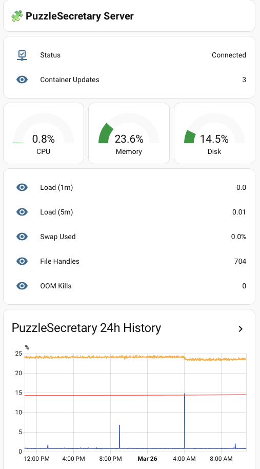
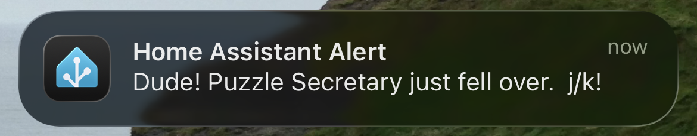

<!-- _class: lead -->
<!-- _paginate: false -->
<!-- _footer: "**Installfest.cz March 28, 2026**" -->

# You Don't Need Kubernetes

## Side Projects on One Linux Server

<div style="display: flex; align-items: center; justify-content: center; gap: 60px; margin-top: 20px;">

<div style="text-align: left; font-size: 0.85em; line-height: 2;">

Brian "bex" Exelbierd
🌐 www.bexelbie.com
✉️ bex@bexelbie.com
 @bexelbie@toot.io
</div>

<!--
- This talk is about how I run a real web service on the internet without Kubernetes, Grafana and the rest — and how it mostly takes care of itself
- I'm Brian Exelbierd 
— worked with Linux for over 20 years
- 10+ years at Red Hat, now working on upstream and community Linux for Microsoft Azure
- I live in Brno and have been in the CZ for 13 years
- I don't speak great Czech, which is why this talk is in English
- Slides are online at the QR Code and on my website
- Disclaimer: My employer, Microsoft has funded my travel to installfest.cz, but this project doesn't reflect their view of the world.  I use Azure in this side project and projects, like Flatcar that they support, but this isn't the only answer.  Use what ever you want.
-->

---

# The Side Project Trap


| "Best Practice" Stack | What You Actually Need |
|:--|:--|
| Build for scale 🚀🚀🚀 | Build for reality |
| Kubernetes cluster | One server |
| CI/CD pipeline for infra | A config file |
| HashiCorp Vault | Your password manager |
| Grafana + Prometheus | Something you already run |
| Hours of maintenance | Hours on your actual project |

<!--
- We've all been here. You have an idea. You want to put it on the internet.
- You go read blog posts about how to do that.
- Suddenly you're building for scale far in excess what you'll ever have
- You're standing up Kubernetes, a secrets vault, a monitoring stack and more just to keep your infrastructure running
- This is fun if you want to learn those tools.
- But if you actually want to build and run a side project, it's a trap.
- The infrastructure becomes the project. The actual thing you wanted to build sits neglected.
- This talk is about a different approach: what if you stopped asking "what's the best tool for this?" and started asking "what do I already have that solves this?"
-->

---

# PuzzleSecretary.com

A web service for tracking social game scores

- I play Wordle, Connections, Strands, etc. with friends across time zones
- We share scores in a Signal chat
- I can track how my friend Peter in the UK is doing — we play at similar times
- But when the US wakes up, it becomes a flood of scores I can't follow
- PuzzleSecretary collects scores from Signal and WhatsApp, builds personal leaderboards and group comparisons

<!--
- This is the thing I actually wanted to build. PuzzleSecretary.
- I play a bunch of social word and logic games with friends. We're in a Signal group chat.
- My friend Peter is in the UK. We both play in the morning. I have a great feel for how he's doing.
- I tend to do better at Wordle than Peter — are we recorded?
- But around the afternoon, all the folks in the US wake up and post their scores
- It becomes a stream of content I can't keep up with.
- I genuinely care how people are doing.
- On a day with a particularly hard I'll go searching through the chat
- But mostly I want it all rolled up — leaderboards, comparisons, trends.
- That's the idea
- It needs to talk to Signal and WhatsApp
- It needs to always be on. It needs to be reliable.
- And critically: I want to spend my time adding games and features, not being a system administrator.
-->

---

# Don't Solve Problems You Don't Have

<pre class="mermaid">
graph LR
    S[Signal] -->|~msgs/day| F[Flask]
    W[WhatsApp] -->|~msgs/day| F
    F -->|INSERT| DB[(SQLite)]
    DB -->|SELECT| F
    F -->|leaderboards| B[Browser]

    style DB fill:#f9f,stroke:#333
</pre>

Human players around the world → low-frequency writes
Friends checking leaderboards → low-frequency reads
SQLite excels at both. One VM. Done.

<!--
- Before we get into architecture, the most important decision you can make is to
- Not solve a scale problem you don't have
- PuzzleSecretary gets messages when people play games
- It serves pages when they look at boards
- Back of the envelope math on basic reads and writes says I should be able to scale to potentially 100,000+ active users on a single server
- Probably even the server I am using - the 2nd smallest (or smallest) VM Azure offers
- I should be so lucky that I overflow my ability to scale this.
-->

---

<!-- _class: lead -->

# What Do I Already Have or Know?


The recurring question behind every decision

<!--
- This is the thesis of the talk
- Every architecture choice I'm about to show you came from asking
- "What do I already have — or already know — that solves this problem?"
- Not "what's the best tool?" Not "what would a blog post recommend?"
- But "what's already running, already paid for, or already understood?"
- Let me show you how this plays out for the operating system, application deployment, secrets, networking, and monitoring
-->

---


# The OS: Flatcar Linux


- Immutable — dm-verity protected `/usr`, no drift
- Auto-updates — atomic, whole-OS, rollback = reboot
- No `apt install` — all your dependencies go in containers
- Treat the OS like firmware: provision once, update automatically
- I work with the Flatcar engineers — virtual throat to choke

**My Flatcar 101 talk is today @ 5pm in Track III**

<!--
- Flatcar is an immutable, container-optimized Linux
- The base OS is read-only and dm-verity protected
- You can't break it accidentally - or on purpose without serious effort.
- Updates are atomic: a new OS image gets staged to an inactive partition, verified, activated on reboot
- If it fails, reboot to the old partition. No intermediate states
- I schedule Wednesday morning updates and expect to never notice.
- You can't apt install things on Flatcar. That sounds like a limitation, but it's the point
- It forces all your dependencies into containers
- which moves dependency management from the OS into the application build where it belongs
- I'm giving a whole separate Flatcar talk at this conference, so I won't go deeper here
- But the key idea for this talk: the OS takes care of itself
- That frees me to focus on how my application runs - which is the next slide.
-->

---

# Containers: Rootless Podman Quadlets

<div style="font-size: 0.8em;">

```ini
[Container]
Image=ghcr.io/bexelbie/puzzlesecretary:latest
Label=io.containers.autoupdate=registry
Volume=/home/app/leaderboard:/data:Z
EnvironmentFile=/home/app/env
PublishPort=127.0.0.1:5000:5000

[Service]
Restart=always
ExecStartPre=/opt/op-secret-manager/op-secret-manager
ExecStopPost=/opt/op-secret-manager/op-secret-manager --cleanup

[Install]
WantedBy=default.target
```

</div>

- Quadlet file = container described as a systemd service
- Rootless = unprivileged host user. Break out? You're still nobody.

<!--
- Podman is a container runtime - most of you probably use Docker
- Podman is basically the same - same OCI container images, same registries
- Two differences matter here: Podman has no central daemon
- and it was built for rootless early on
- It also has quadlets - if you know systemd, you already know how to manage Podman containers
- Rootless is a key security feature. The container runs as a non-privileged user on the host. Even if someone breaks the app, becomes root in the container, AND escapes to the host - they're just a regular user. They need another exploit to get anywhere.
- Containers are great, but to use them you have to run them
- Docker makes you write systemd units, rely on their daemon or learn compose
- I use Podman Quadlets for this. A Quadlet is a Podman-specific file that describes a container
- You drop it in a directory, run systemctl daemon-reload, and systemd picks it up as a service
- Automatic restarts on failure, logging to journald, dependency ordering between services - all for free
- No container orchestrator needed.
- Let me walk through this.
- Image - where to pull the container - if it isn't already on disk
- Label - that tells Podman where to check for newer images - more on this later
- Volume - persistent SQLite data that survives container restarts
- EnvironmentFile - secrets get injected here, we'll come back to this too
- PublishPort - Flask on 5000, bound to localhost, I'll explain why in a bit
- In services you see the standard systemd restart
- and ExecStart and ExecStop deal with secrets management - which is the next slide
-->

---

# Secrets: Your Password Manager is Already a Vault

<pre class="mermaid">
graph LR
    A[1Password] -->|API| B[OP Secret Manager]
    B -->|files| C[/run/secrets/]
    B -->|env vars| D[Quadlet .env files]
    C --> E[Containers]
    D --> E
    style A fill:#0572ec,stroke:#333,color:#fff
    style E fill:#f9f,stroke:#333
</pre>

- Your password manager stores credentials, notes, files — and has an API
- Applications understand files and environment variables
- Connect the two: pre-exec in systemd downloads secrets before the service starts
- I also store configuration as 1Password notes — centralized secrets AND config
- managed with github.com/bexelbie/op-secret-manager

<!--
- Secrets management is hard
- Having secrets spread out in multiple places is harder
- I have both manage them and remember where they are
- But I already have a secrets management system
- 1Password. Family plan, works across all my devices
- and it has an API.
- Applications understand files and environment variables, not 1Password
- I built op-secret-manager
- Before a service starts, systemd runs it as a pre-exec step
- It downloads secrets from 1Password and puts them where the service expects
— files in /run, environment variable files that Quadlets inject
- Post-exec cleans up.
- This extends beyond secrets
- I store JSON and YAML configs as 1Password notes too. Centralized secrets AND configuration in one place I already managed.
-->

---

<!-- _footer: "**You Don't Need Kubernetes — Installfest.cz 2026 \nwww.bexelbie.com · @bexelbie@toot.io**" -->

# Network: Zero Open Ports


| Inbound Traffic | How |
|:--|:--|
| Web (puzzlesecretary.com) | Cloudflare Tunnel |
| SSH (management) | Tailscale |
| Open ports on the VM | **None** |

<!--
- Two networking choices, both driven by reducing attack surface.
- Cloudflare Tunnel: a container on the host connects outbound to Cloudflare
- When you visit puzzlesecretary.com, Cloudflare routes the request down the tunnel
- No port 443 open
- Bonus: no SSL certificate management. Free tier.
- Tailscale for a private network/VPN
- installs on Flatcar as a systemd system extension
- no container wrapper needed. Connects to my tailnet
- SSH from any of my devices, port 22 not open to the world
- Both connect outbound. No inbound ports needed on the VM at all
-->

---

<!-- _class: lead -->

# Monitoring and Alerting

## Why Not Grafana?

1. I don't want to run more infrastructure just for running infrastructure
2. I am not going to look at a dashboard

<!--
- This is where the "what do I already have?" question gets its most interesting answer.
- Most people would solve monitoring by standing up Grafana or something similar
- or a SAAS version ...  and then doing a bunch of instrumentation work
- I had two reasons for going a different way.
- First: I don't want to stand up another piece of infrastructure.
- The whole point of this talk is avoiding that.
- Second, and more importantly: I am not going to look at a dashboard.
- I'm not going to get up every morning and check traffic graphs
- I'm not going to keep a monitor in the corner with pretty lines and blinky things
- This isn't my day job.
- I want this thing to run itself off to the side like a good side project should
- and let me do the cool thing — adding more games, improving the UX, whatever
- But I can't just ignore the problem entirely
- One day this thing will fall over — out of memory, disk full, something
- When that happens, I'll want to understand what the utilization curve looked like
- I need to track key pieces of information that help me debug
- and that might not be in logs
- The first question to answer is, "how do I get this data?"
-->

---

# The Pipeline: Telegraf → MQTT → ???

<pre class="mermaid">
graph LR
    subgraph VM ["Azure VM"]
        C[Containers] -->|metrics| T[Telegraf]
        T -->|publish| M[MQTT messages]
    end
    M --> Q["???"]
    style VM fill:#e8f4f8,stroke:#333
    style T fill:#4b275f,stroke:#333,color:#fff
    style Q fill:#ffd700,stroke:#333
</pre>

- Telegraf: container that gathers system and custom metrics
- MQTT: lightweight message protocol
- Metrics flow out to ... something that stores time-series data and alerts

<!--
- On the collection side I use Telegraf, from InfluxDB
- It is an open-source metrics agent
- It's a container that runs on the VM, gathers CPU, memory, disk, process counts
- It also reads custom metrics — I use this to track how many containers need updates
- It publishes MQTT messages to ... well that is question 2 ...
- I need something that tracks values over time, stores them, graphs them
- ... and isn't Grafana because I ruled that out.
-->

---

#  Home Assistant



We think of it as "turn on the lights."
It's actually: track a value, store it, graph it, alert on it.

- Battery levels, temperature, meter readings — all time-series data
- Long-term statistics engine built in
- Already running MQTT at my house for unrelated reasons
- I use this pattern for two servers now

<!--
- Home Assistant
- Most people think home automation — turn on the lights.
- But a big part of HA is being a time-series database
- take a value, store it, graph it over time
- Battery levels, temperature, water meters
- all tracked with a long-term statistics engine
- I already run it on a Home Assistant Green at home
- And it was already running MQTT because I have a light that speaks MQTT
- And it is on my Tailscale Tailnet because I want to get to it from anywhere ...
- So I pointed Telegraf's MQTT output at HA
- It picks up the metrics, creates entities, stores them in long-term statistics
- Here's what the dashboard looks like
- It works so well I wired up my other VPS that I use for personal workloads
— I rarely look at it, but it's there if I need it
-->

---

# Alerting: Home Assistant Knows How to Reach You

Home Assistant can:
- Push a notification to your phone
- Override silent mode for critical alerts
- Add an item to your to-do list
- Put a message on an e-ink display
- It could even flash the lights and pause the movie if needed



<!--
- Gathering statistics is one thing. Alerting is something else
- But if you think about it, HA solves this too
- HA already knows how to send me notifications
- It literally knows where I live
- It can push to my phone
- It can override silent mode for critical alerts
- It can add something to my Todoist task list
- It can put a message on an e-ink display
- All I had to do was write a few automation configs to look at the incoming data and decide when I need to know about something
- Container updates? Entry in my to-do list: "On Wednesday, update these containers."
- Memory concerns or high CPU? Alert to my phone.
- The system stops sending metrics at all? That means it fell over — tell me immediately.
- I didn't have to build an alerting system
- I didn't have to sign up for PagerDuty
- I wrote a few automations using a system I already understood
- and that I already need to have running
-->

---

# The Architecture

One VM. Six connections to things I already had.

<pre class="mermaid">
graph LR
    MO[Montastic] -.->|probe| CC[Cloudflare]
    CC -->|tunnel| VM[VM: Flatcar + Quadlets]
    VM -->|fetch secrets| OP[1Password]
    VM -->|MQTT/Tailscale| HA[Home Assistant]
    HA -->|alerts| PH[Phone]
    LAP[Laptop] -->|SSH/Tailscale| VM
</pre>

<!--
- So here's the complete picture
- everything we just walked through on one diagram.
- One VM running Flatcar Linux
- Inside it, rootless Podman containers managed by systemd Quadlets.
- Secrets and configuration come from 1Password over its API.
- Public traffic comes through a Cloudflare Tunnel — no open ports.
- I SSH in over Tailscale — also no open ports.
- System statistics flow over MQTT through Tailscale to Home Assistant at my house.
- Home Assistant handles monitoring, alerting, and notifications.
- Every external connection here is something I was already running for other reasons. I stood up zero new infrastructure services other than the literal VM I am using for the service
- I also use my existing Montastic.io free account to provide an external "is it still alive?" check
-->

---

# Day 2: What Maintenance Looks Like

| When | What | How long |
|:--|:--|:--|
| Most days | Nothing. It runs itself. | 0 min |
| Wednesday | HA says "3 containers need updates" → SSH in, `podman auto-update` | 5 min |
| When I ship a feature | Push release to Github, container auto built then load it | 15 min |
| Something breaks | HA alerts my phone, I SSH in and look at logs | varies |
| OS update | Flatcar stages it, reboots Wednesday morning | 0 min |

<!--
- So what does this actually feel like to run?
- This is the part the architecture diagrams don't tell you.
- Most days: nothing. I don't log in. I don't check dashboards. The system runs itself.
- Wednesdays are my maintenance window
- Flatcar handles its own OS updates the same morning. It stages the update to the inactive partition and reboots. I don't even notice unless something goes wrong - and if it does, it rolls back automatically.
- Also for Wednesdays, Home Assistant adds a to-do item if containers have newer images
- I SSH in, run podman auto-update, it pulls the new images and restarts the affected services
- Five minutes, usually while drinking coffee.
- This is going so well I'll probably just have it auto-update Just before the OS updates and drink my coffee while playing games instead
- When I want to ship a new feature for PuzzleSecretary, I push a release in the repo and a Github action builds me a new container. The next auto-update picks it up and schedules it for Wednesday, or I trigger it manually if I'm impatient.
- The whole promise of this architecture is
- spend your time on the fun part
- And this is what that actually looks like in practice
- Most weeks I spend zero minutes on infrastructure
-->

---

# The Recurring Question


Every decision followed the same pattern:

| I need... | I already have or know ... |
|:--|:--|
| A server OS | Flatcar (from my day job) |
| Container management | Podman Quadlets → systemd |
| A secrets vault | 1Password (family plan) |
| Secure networking | Cloudflare + Tailscale |
| Monitoring | Home Assistant + MQTT |
| Alerting & notifications | Home Assistant automations |
| External uptime check | Montastic (free) |

<!--
- Look at this table
- Every single row is the same pattern
- I had a need. I looked at what I already owned, already paid for, already understood
- And I used that.
- I stood up zero new infrastructure services. Everything here was either already running or was a free service with a clear model.
- Kubernetes is the answer when you start from "what's the ideal tool for each problem?" This architecture is the answer when you start from "what do I already have?" and a goal of getting to the fun part faster.
- For side projects and homelab work, "what do I already have?" is almost always the better question.
-->

---

# Adapt the Principle, Not the Stack

You don't need my specific tools. You need the question.

- Flatcar → Fedora CoreOS, NixOS, whatever immutable OS fits
- 1Password → Bitwarden, any password manager with an API
- Home Assistant → Uptime Kuma, anything that tracks values and alerts
- Cloudflare Tunnel → ngrok, bore, any reverse tunnel
- The principle: stretch what you already know and pay for

<!--
- I want to be clear
- this is not a talk about "use Flatcar, 1Password, Cloudflare, and Home Assistant."
- Those are my answers. Yours will be different.
- The transferable thing is the question
- what do you already own that solves this?
- The principle is the same
- stretch the tools you already know, already pay for, already trust
- Stop building infrastructure for your infrastructure.
- Save your energy for the actual thing you wanted to build.
-->

---

<!-- _class: lead -->
<!-- _paginate: false -->
<!-- _footer: "**Installfest.cz March 28, 2026**" -->

# Thank You

**Come to Flatcar 101** → Today @ 5pm, Track III
**Try PuzzleSecretary** → puzzlesecretary.com

<div style="display: flex; align-items: center; justify-content: center; gap: 60px; margin-top: 20px;">

<div style="text-align: left; font-size: 0.85em; line-height: 2;">

Brian "bex" Exelbierd
🌐 www.bexelbie.com
✉️ bex@bexelbie.com
 @bexelbie@toot.io

</div>
</div>

<!--
- Thank you!
- PuzzleSecretary is at puzzlesecretary.com if you want to see the thing itself
- Slides are online at the QR Code and on my website
- If you want the deep dive on Flatcar Linux, come to my Flatcar 101 talk at this conference
- Questions?
-->

---

<!-- _class: lead -->
<!-- _paginate: false -->
<!-- _footer: "" -->

<!-- Mermaid rendering: use `marp --html` to enable -->
<script src="https://unpkg.com/mermaid@11/dist/mermaid.min.js"></script>
<script>
  mermaid.initialize({ startOnLoad: false });
  window.addEventListener('load', async () => {
    for (const el of document.querySelectorAll('pre.mermaid')) {
      const { svg } = await mermaid.render('m' + Math.random().toString(36).slice(2), el.textContent);
      const img = document.createElement('img');
      img.src = `data:image/svg+xml;base64,${btoa(svg)}`;
      el.replaceWith(img);
    }
  });
</script>

<!-- Build Notes:
Build: marp --pptx --html nokube-slides.md -o nokube-slides.pptx --allow-local-files
QR Code: qrencode -o /Users/bexelbie/repos/blog/bexelbie.github.io/working-notes/qr-bexelbie.png -s 10 -m 2 "https://www.bexelbie.com"
-->
