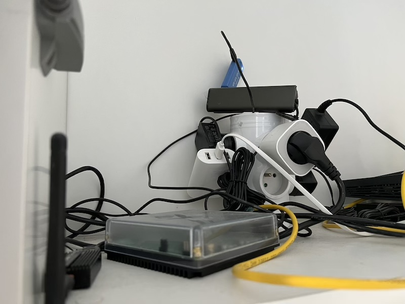
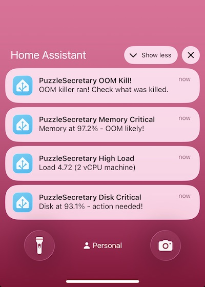
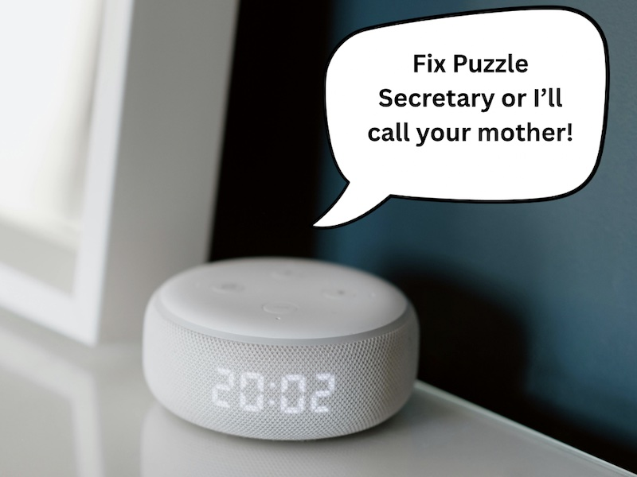
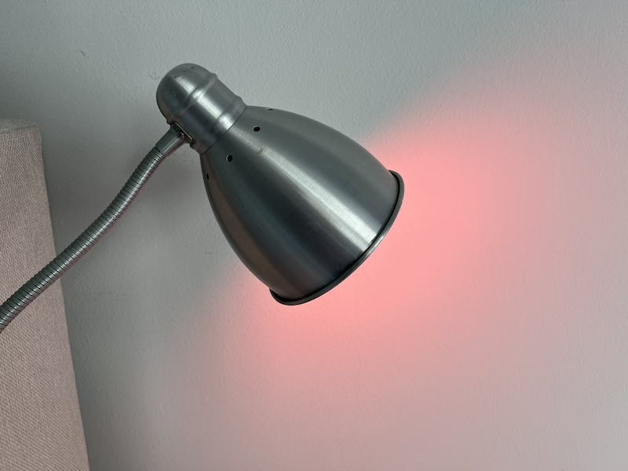

<!-- _class: lead -->
<!-- _paginate: false -->
<!-- _footer: "**KCD Czech & Slovak · Prague · May 2026**" -->

# The 139 € Monitoring Stack

Brian "bex" Exelbierd
🌐 www.bexelbie.com
✉️ bex@bexelbie.com
 @bexelbie@toot.io

<!--
- Hi, I'm bex. I work at Microsoft on Linux things, but this talk has nothing to do with that.
- 139 euros is not a typo. That's my entire monitoring budget. It's really less than that and you'll see why.
- I run a significant load bearing piece of internet infrastructure ...
-->

---

# PuzzleSecretary.com

A real app. Real users. Real internet. Needs real monitoring.

- Tracks Wordle, Connections, Strands scores across friend groups
- Collects from Signal and WhatsApp (soon)
- Builds leaderboards and comparisons

<!--
- I am of course talking about puzzlesecretary.com
- This is a production web service. People use it every day.
- In full disclosure, runs on one Azure VM. No cluster. No fleet. Just one server, bravely existing without a service mesh.
- But it still needs monitoring.
-->

---

# I Need Monitoring

| The "Right" Way | |
|:--|:--|
| Prometheus | ✓ |
| Grafana | ✓ |
| Loki | ✓ |
| Alertmanager | ✓ |
| PagerDuty | ✓ |
| A weekend of YAML | ✓ |
| My will to live | ✗ |

<!--
- You all know the proper way. This is your day job.
- Metrics, logs, traces, dashboards, alerts, a small galaxy of YAML.
- Step 1: install and wire up 17 things. Step 2: your soul leaves your body.
- I love all of you for building this. But .. do not want.
- My side project is playing games and improving puzzlesecretary
- NOT monitoring puzzle secretary
-->

---

# My Confession

I am an absentee operator.

I will never look at a dashboard.

I will only care when something breaks.

**So it had better tell me when it breaks.**

<!--
- I have some more confessions to make.
- I'm not going to get up every morning and check traffic graphs.
- I'm not keeping a monitor in the corner with pretty lines.
- I need a system that yells at me. Not one that waits politely to be consulted.
-->

---

<!-- _class: lead -->

# Home Assistant !?!?!

  

<!--
- My monitoring stack is Home Assistant on a Home Assistant Green.
- It costs 139 euros. It lives in my data center.
-->

---

<!-- _class: lead -->

# Home Assistant !?!?!

  
  

<!--
- My monitoring stack is Home Assistant on a Home Assistant Green.
- It costs 139 euros. It lives in my data center.
- Like PagerDuty, it can blow up your phone.
-->

---

<!-- _class: lead -->

# Home Assistant !?!?!

  
  
  

<!--
- My monitoring stack is Home Assistant on a Home Assistant Green.
- It costs 139 euros. It lives in my data center.
- Like PagerDuty, it can blow up your phone.
- Unlike PagerDuty, home assistant can haunt you
-->

---

<!-- _class: lead -->

# Home Assistant !?!?!

  
  
  
  

<!--
- My monitoring stack is Home Assistant on a Home Assistant Green.
- It costs 139 euros. It lives in my data center.
- Like PagerDuty, it can blow up your phone.
- Unlike PagerDuty, home assistant can haunt you
- Nothing says SEV-1 like your hallway being disappointed in you.
-->

---

# It's Not Actually Crazy

Home Assistant **is** a monitoring stack ...

| Capability | HA has it? |
|:--|:--|
| Time-series database | ✓ (long-term statistics) |
| Graphs & dashboards | ✓ |
| MQTT ingestion | ✓ (already running for a light) |
| Alerting & notifications | ✓ (push, silent override, to-do) |
| On my Tailscale VPN | ✓ (already was) |
| Always on, 24/7 | ✓ (it runs my house) |

.. it just comes in a box that didn't say "monitoring stack."

<!--
- Here's why this isn't as ridiculous as it sounds.
- HA already stored time-series data: batteries, temperatures, water meter readings.
- What is CPU load but a temperature sensor for nerds?
- It already ran MQTT because one of my lights needs it.
- It was already on Tailscale because I wanted remote access.
- It was already always-on because it if it isn't I have to turn on the lights with a switch ... like an animal.
- I didn't install a monitoring stack. I noticed I already had one.
-->

---

# The Dashboard

<!--
- There is a dashboard that I don't look at
- But when something breaks, the history is there.
- I can see the curve that led to the problem.
-->

---

# The Architecture

<pre class="mermaid">
graph LR
    subgraph VM ["Azure VM"]
        C[Containers] -->|metrics| T[Telegraf]
    end
    T -->|MQTT over Tailscale| HA["Home Assistant"]
    HA -->|alerts| P[Phone / Lights / Speaker]
    style VM fill:#e8f4f8,stroke:#333
    style HA fill:#18bcf2,stroke:#333,color:#fff
</pre>

<!--
- Telegraf runs as a container on the VM. Gathers stats about both the server and the game system itself.
- Publishes MQTT messages over Tailscale to Home Assistant.
- Home assistant makes decisions about alerts and tracks stats
- That's it. That's the whole thing.
-->

---

# How Did I Get Here?

I asked three questions for every infrastructure decision:

## "What do I already have, know, or pay for that solves this?"

| I needed... | I already had... |
|:--|:--|
| Monitoring & time-series | Home Assistant Server (€139) |
| Alert delivery | HA notifications |
| Secure transport | Tailscale (already on both) |
| Metric collection | Telegraf (5 min to set up) |

Brian "bex" Exelbierd 
🌐 www.bexelbie.com 
✉️ bex@bexelbie.com 
 @bexelbie@toot.io

<!--
- The take away is this
- I didn't set out to build something weird.
- I asked: what do I already have, already know, and already pay for? And then I looked to see if those things would just solve my problem.
- This lets me stay focused on the fun part — adding games, improving UX. Delivering my product.
- Monitoring: Home Assistant. Transport: Tailscale. Collection: Telegraf from InfluxDB
- The point isn't "use Home Assistant."
- Before you build a platform for your platform, ask what you already have, know or pay for.
- Thank you. I'm bex. The slides are at the QR code.
-->

---

<!-- _class: lead -->
<!-- _paginate: false -->
<!-- _footer: "" -->

<!-- Mermaid rendering: use `marp --html` to enable -->

